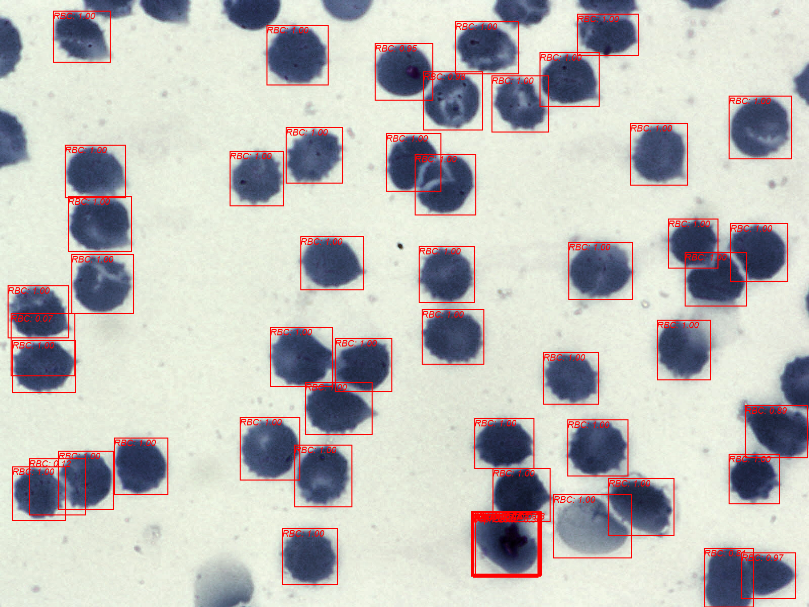

# malaria-detection

This project is trying to detect malaria cells specifically plasodium vivax and it's stage from thin blood smear images using pytorch Faster-RCNN algorithm. The dataset used .
The project consists of 3 main notebooks and 2 scripts, each does the following:

## 

This notebook clean and prepare data for training. It also explore the data like the balance state of the dataset, the dimension and aspect ratios of the bounding boxes, hieght and width of the images, area frequencies of the bboxes, and more.

## 

This notebook is to determine what are the optimum anchor box bimensions to be used with this dataset. This is a crusial step because a bad anchor boxes sizing will prevent the algorithm from effictively learning.

The technique used to find the size and aspect ratio of the anchor boxes is by clsutering the bboxes to a set of anchors using K-MEANS clustering algorithm and then updating the anchor boxes sizing based on iou distance.

## 

This notebook fine-tune faster-rcnn pytorch model with roi-align and fpn(feature peramid network) with resnet-50 backbone. It uses mixed-percision training as well as Exponential learning rate scheduler for optimum training.

the following results were achieved:
IoU metric: bbox
 Average Precision  (AP) @[ IoU=0.50:0.95 | area=   all | maxDets=100 ] = 0.277
 Average Precision  (AP) @[ IoU=0.50      | area=   all | maxDets=100 ] = 0.353
 Average Precision  (AP) @[ IoU=0.75      | area=   all | maxDets=100 ] = 0.338
 Average Precision  (AP) @[ IoU=0.50:0.95 | area= small | maxDets=100 ] = -1.000
 Average Precision  (AP) @[ IoU=0.50:0.95 | area=medium | maxDets=100 ] = 0.226
 Average Precision  (AP) @[ IoU=0.50:0.95 | area= large | maxDets=100 ] = 0.278
 Average Recall     (AR) @[ IoU=0.50:0.95 | area=   all | maxDets=  1 ] = 0.214
 Average Recall     (AR) @[ IoU=0.50:0.95 | area=   all | maxDets= 10 ] = 0.489
 Average Recall     (AR) @[ IoU=0.50:0.95 | area=   all | maxDets=100 ] = 0.594
 Average Recall     (AR) @[ IoU=0.50:0.95 | area= small | maxDets=100 ] = -1.000
 Average Recall     (AR) @[ IoU=0.50:0.95 | area=medium | maxDets=100 ] = 0.244
 Average Recall     (AR) @[ IoU=0.50:0.95 | area= large | maxDets=100 ] = 0.625

## 

This script calculates the mean and standard deviation(std) for the images in the dataset. This is used to normalize the images before feeding it to the network avoiding any biases in the training process. Normalization helps to ensure that all input data falls within a similar range and has a similar distribution, making it easier for the neural network to learn and generalize from the data.

 ## 

 This script is for running the model and displaying the results.
 output example:
 

## Learning outcomes

## conclusion

The project results aren't statisfying mainly due to high imbalance nature of the dataset. the model was able to detect with high percision and recall the cells, but failed with classifying them correctly. 

